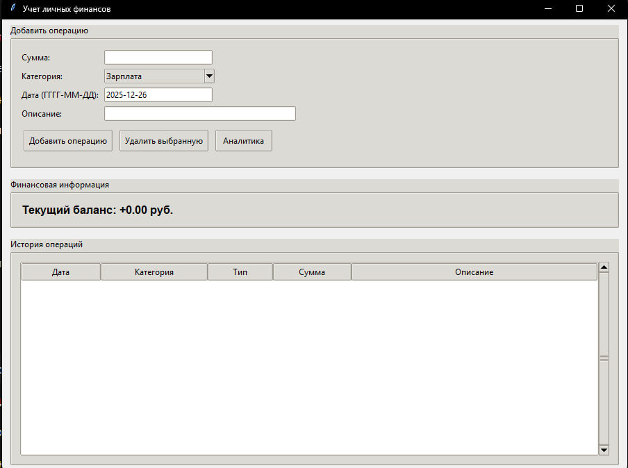
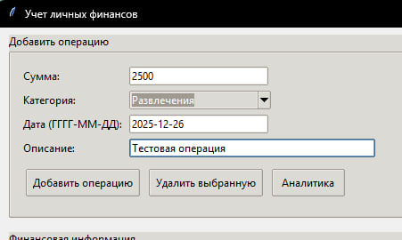
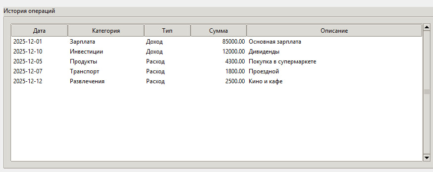
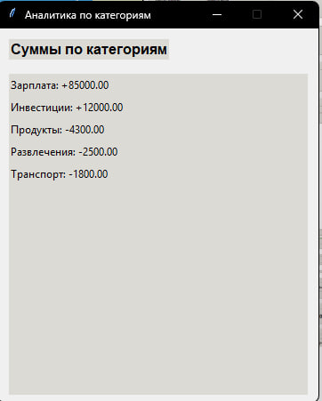
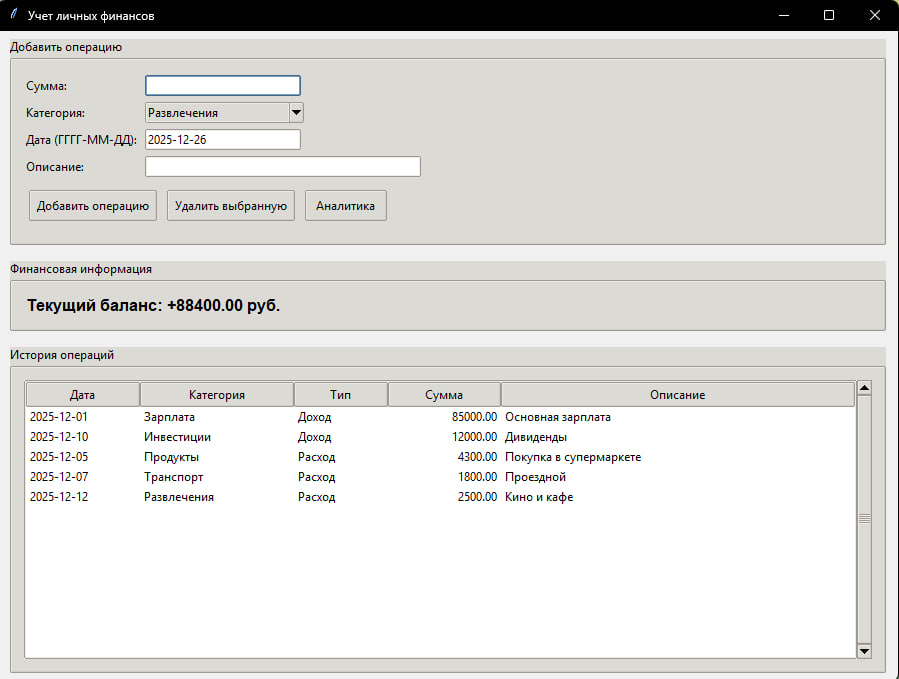

# Personal Finance Manager

Desktop‑приложение для учета личных финансов (доходы/расходы) на **Python + Tkinter**.

## Функциональность

- Добавление операций (сумма, категория, дата, описание)
- Удаление выбранной операции
- Хранение данных в **CSV** (`transactions.csv`) с автозагрузкой при запуске
- Расчёт **текущего баланса**
- Простая аналитика: суммы по категориям

## Структура проекта

```
personal-finance-app/
├── finance_classes.py
├── finance_gui.py
├── transactions.csv
├── requirements.txt
└── README.md
```

## Запуск

1) Установите Python 3.7+  
2) Откройте терминал в папке проекта и выполните:

```bash
python finance_gui.py
```

> Tkinter входит в стандартную поставку Python на Windows.

## Git / GitHub (пример)

```bash
git init
git add .
git commit -m "Init: finance manager classes + CSV"

git add .
git commit -m "Add Tkinter GUI + analytics"

git branch -M main
git remote add origin https://github.com/<ваш-логин>/personal-finance-app.git
git push -u origin main
```

## Скриншоты приложения

### Главное окно


### Добавление операции


### История операций


### Аналитика по категориям


### Текущий баланс

